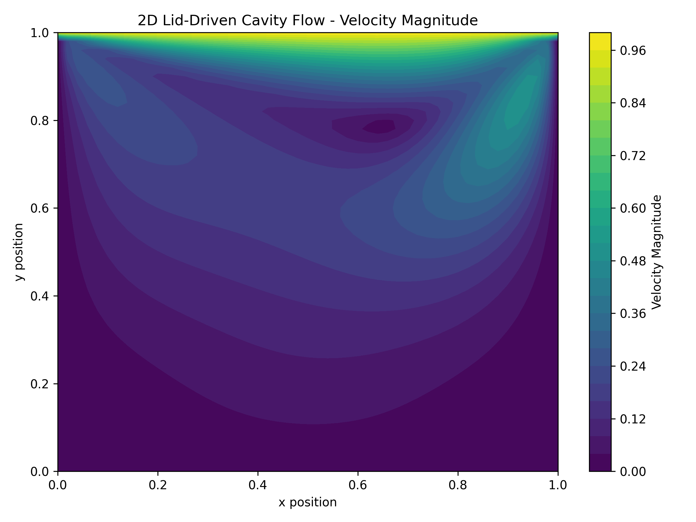
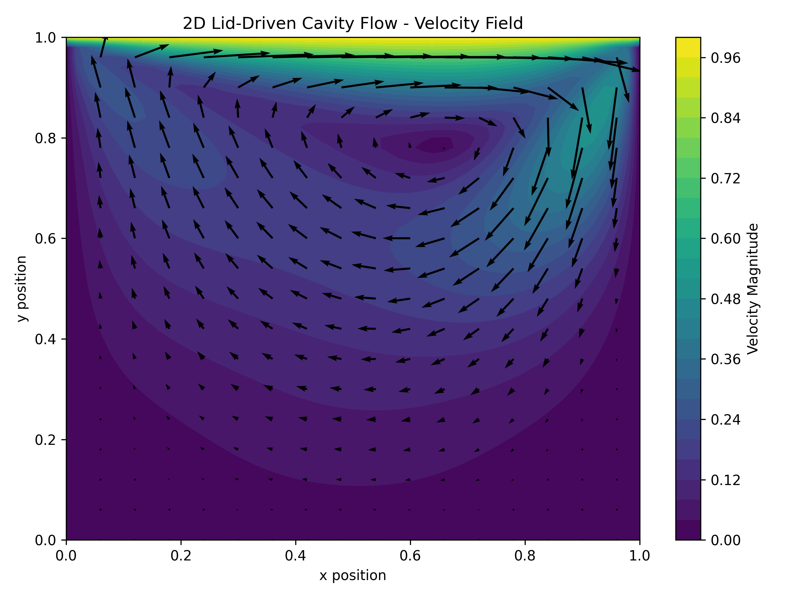

# 2D Navier-Stokes CFD Solver

A Python-based 2D computational fluid dynamics simulation of lid-driven cavity flow.

## Project Overview

This project simulates fluid flow inside a square cavity.

The top wall moves horizontally while the other three walls remain stationary. The moving wall causes the fluid inside the cavity to circulate.

## Physics

The simulation is based on the incompressible Navier-Stokes equations.

The project uses the streamfunction-vorticity formulation to calculate the flow field.

## Numerical Method

The simulation uses finite difference methods to approximate the governing equations on a two-dimensional computational grid.

## Features

- 2D computational grid
- Incompressible fluid flow
- Lid-driven cavity
- Finite difference method
- Streamfunction formulation
- Vorticity formulation
- Velocity field visualization
- Velocity magnitude visualization

## Technologies

- Python
- NumPy
- Matplotlib

## Results

### Velocity Magnitude

### Velocity Field

## Future Improvements

- Increase grid resolution
- Add animation
- Test different Reynolds numbers
- Improve numerical efficiency
- Compare results with published benchmark solutions

## Author

Daniel John
